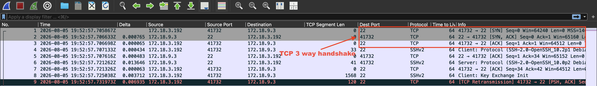
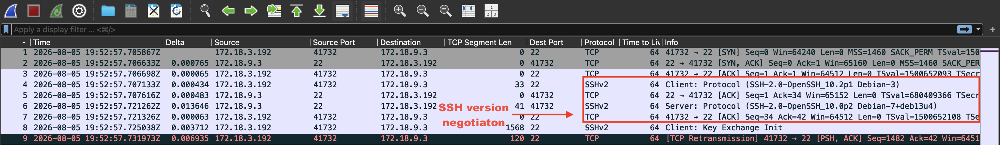
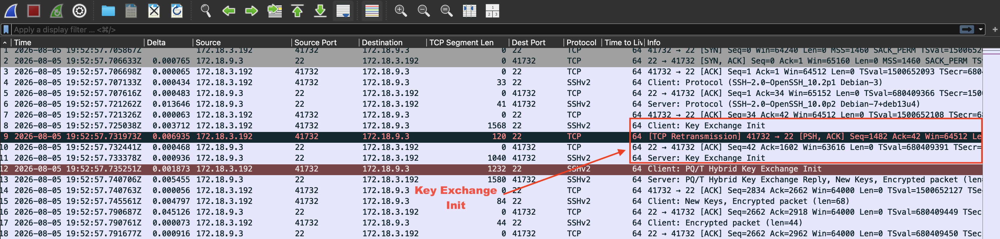
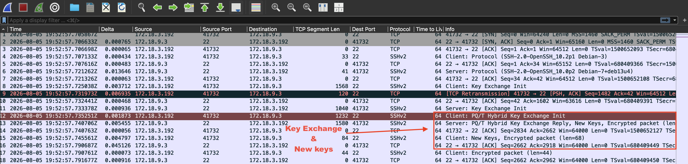
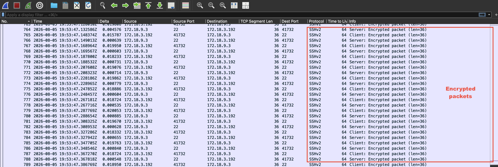
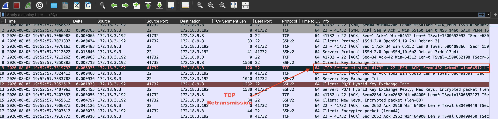
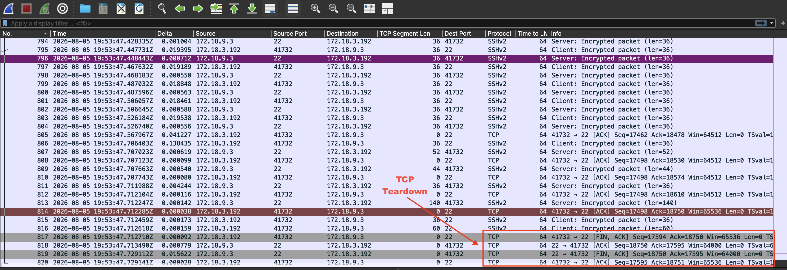

# SOC Handler's Journal

## Case: 001
## Title: Baseline SSH Session Analysis

## Environment Characteristics
- Debian machine at `172.18.9.3`
- Kali machine at `172.18.3.192`
- Both machine's network adapter connection are Bridged

## Summary: SSH Handshake & TCP Retransmission Analysis

Packet capture analysis of an SSH session between a client (172.18.3.192) and server (172.18.9.3), covering the TCP three-way handshake, SSH version negotiation, and a post-quantum hybrid key exchange (`mlkem768x25519-sha256`) using `ECDH (X25519)` and `ML-KEM-768`.

The analysis also investigates a TCP retransmission observed during the key exchange, which indicates a possible **spurious retransmission** (confirmed via D-SACK) rather than actual packet loss.

📄 **[Full Analysis](https://docs.google.com/document/d/1b63c6KGsGmSbOB2Ourc4M4PqfGvFth3ek5vmj7DNNMY/edit?usp=sharing)**

## Screenshots

### TCP Three-Way Handshake (Frames 1-3)
Client and server complete the 3-way handshake

### SSH Version Negotiation
Both client and server confirm SSH v2.

### Key Exchange Init (SSH_MSG_KEXINIT)
Client and server exchange supported algorithm lists.

### PQ/T Hybrid Key Exchange and New Keys 
Actual key exchange and new keys derivation

### Transmitted Encrypted Packets
Encrypted packets

### TCP Retransmission
Spurious retransmission indicated via D-SACK

### Session Teardown
Standard TCP four-way close.

